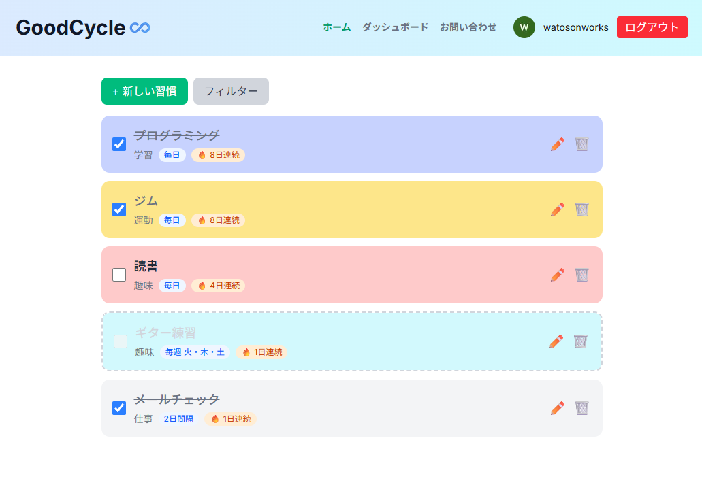
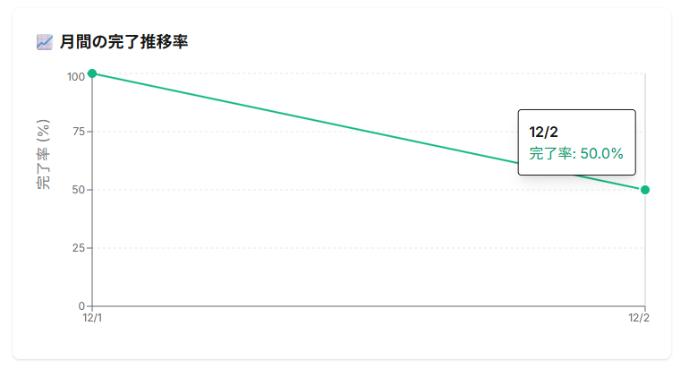
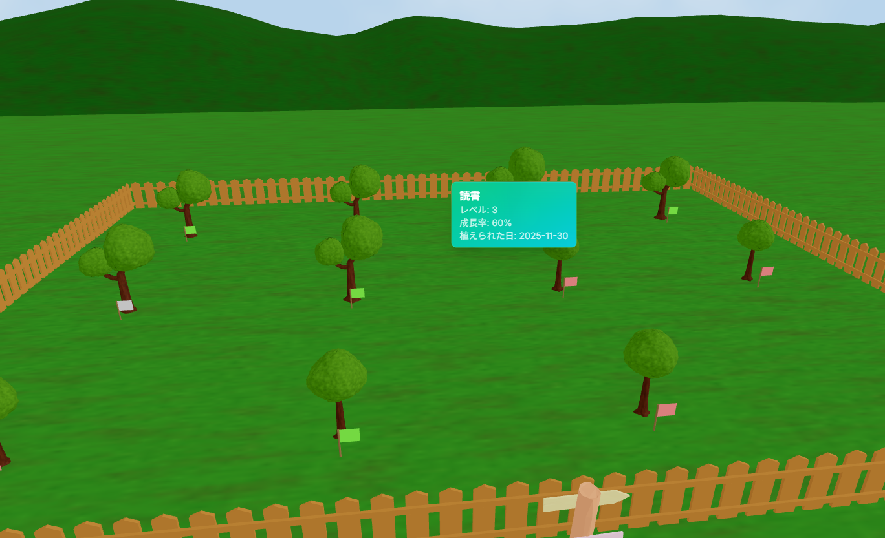
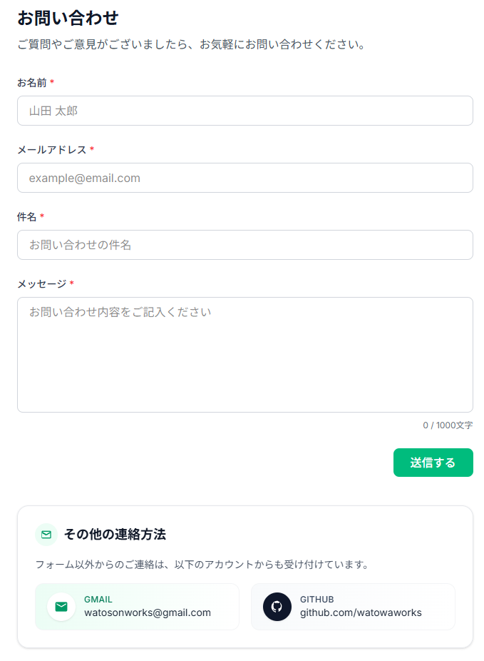

## GoodCycle ♾️（習慣化トラッカーアプリ）

Next.js (App Router)、Firebase、React Three Fiberを使って作成した、**習慣の継続を「見える化」するトラッキングアプリ**です。  
毎日の完了状況をカード・カレンダー・グラフで可視化し、「続けやすい仕組み」を提供します。

---

## デモ

- **URL**: https://goodcycle-habit-app.vercel.app

---

## 主な機能

### ユーザー認証

- Firebase Authentication による Google アカウントでの認証
- ログイン状態に応じたナビゲーション制御
- ログイン時は Firestore にデータを保存、非ログイン時はローカルストレージに保存

### 習慣の登録・編集・削除

- **習慣追加**: モーダルからタイトル・カテゴリ・カラーを設定
- **頻度設定**: 各習慣に実施頻度を設定可能
  - **毎日**: 毎日実施する習慣
  - **毎週**: 特定の曜日のみ実施する習慣（例：月・水・金）
  - **間隔**: N 日ごとに実施する習慣（例：3 日ごと）
- **編集機能**: 統合された編集モーダルでタイトル・カテゴリ・カラー・頻度を一括編集
- **完了状態の切り替え**: 実施日にのみ完了状態を ON/OFF 可能（頻度に基づく制御）
- **削除機能**: 不要になった習慣の削除

### ストリーク機能

- **連続日数（ストリーク）**: 各習慣の現在の連続日数と最長連続日数を自動計算
- **ダッシュボードサマリー**: 最も継続できている習慣を表示

### ダッシュボード（ログイン時のみ利用可能）

- **全体サマリー**: 最も継続できている習慣の表示
- **習慣別詳細統計**:
  - **今週の完了率**: 今週の完了率と先週との比較
  - **完了状況カレンダー**: 過去 7 日間/30 日間の完了状況を可視化
    - 実施日・完了日・未完了日・対象外日を色分け表示
  - **月間の完了推移率**: 月間の完了率推移をグラフで表示（Recharts）

### ガーデン（ログイン時のみ利用可能）

- **3D 空間での習慣の可視化**: React Three Fiber を使用したインタラクティブな 3D ガーデン
- **木モデルによる成長表現**: 各習慣が木として表現され、成長率に応じて 5 段階のモデルを表示
  - 成長率に基づいて自動的に適切な木モデルを選択
  - 円形に配置された木を自由に回転・ズームして観察可能
- **動的な天気システム**: 庭全体の天気が習慣の完了状況に応じて変化
  - **晴れ**: 完了率が高い場合
  - **曇り**: 完了率が中程度の場合
  - **雨**: 完了率が低い場合（雨粒のアニメーション）
  - **雷雨**: 完了率が非常に低い場合（稲妻とフラッシュ効果）
- **インタラクティブなツールチップ**: 木モデルをホバー/タップすると、習慣の詳細情報を表示
  - 習慣名、レベル、成長率、植えられた日を表示
- **パフォーマンス最適化**: InstancedMesh を使用した効率的な 3D レンダリング

### フィルタリング・カテゴリ管理

- **フィルタリング**: 完了/未完了/すべてで習慣を絞り込み
- **カテゴリフィルタ**: カテゴリごとの絞り込み
- **カテゴリ管理**: カスタムカテゴリの追加・削除（ログイン時のみ）
- **カラー管理**: 習慣ごとにカラーを設定して視覚的に識別

### お問い合わせフォーム

- EmailJS を使った問い合わせ送信フォーム
- バリデーション・送信中状態・成功/エラー表示
- Gmail / GitHub アカウントへのリンク

### ダークモード対応

- **ライト/ダーク/システム（自動）の 3 つのテーマモード**
- テーマ設定の localStorage 保存（次回訪問時も維持）
- システムテーマ変更の自動検知
- すべてのページ・コンポーネントでダークモード対応

### プッシュ通知機能

- **ブラウザを閉じても通知が届く**: Service Worker + Firebase Cloud Messaging (FCM) によるバックグラウンド通知
- **通知時刻の設定**: 各習慣に通知時刻（HH:MM 形式）を設定可能
- **自動通知送信**: Cloud Functions のスケジュール実行により、設定した時刻に自動で通知を送信
- **実施日の判定**: 習慣の頻度設定（毎日/毎週/間隔）に基づいて、実施日のみ通知を送信
- **複数デバイス対応**: 複数のブラウザ/デバイスで同じアカウントにログインしている場合、すべてのデバイスに通知を送信
- **通知設定の永続化**: 通知設定は Firestore に保存され、ページをリロードしても保持される
- **注意**: モバイル（iOS/Android）での通知機能には対応していません。デスクトップブラウザ（Chrome、Edge、Firefox など）でのみ動作します

---

## 技術スタック

### フロントエンド

- **Next.js 16**（App Router / TypeScript）
- **React 19**
- **Tailwind CSS 4**

### バックエンド / BaaS

- **Firebase Authentication**: ユーザー認証
- **Cloud Firestore**: 習慣データ・カテゴリデータの永続化
- **Firebase Cloud Messaging (FCM)**: プッシュ通知の送信
- **Firebase Cloud Functions**: スケジュール実行による通知送信の自動化

### 状態管理・ロジック

- **Zustand**: クライアント状態管理（習慣データ、フィルタ、カテゴリなど）
- **カスタムフック**: クリック外検知（`useClickOutside`）など
- **日付処理**: 完了率計算、ストリーク計算、頻度判定などのユーティリティ関数

### 可視化 / UI

- **Recharts**: 月間の完了推移率グラフ表示
- **React Three Fiber (R3F)**: 3D ガーデンのレンダリング
- **@react-three/drei**: 3D シーンの補助機能（OrbitControls、useGLTF、Html など）
- **Three.js**: 3D グラフィックスライブラリ（R3F の基盤）
- **自作コンポーネント**:
  - ダッシュボードカード（完了率、カレンダー、グラフ）
  - タブ UI（習慣切り替え）
  - モーダル（習慣追加・編集、フィルタ、カテゴリ管理）
  - 習慣カード（完了状態切り替え、編集・削除）
  - 3D ガーデンコンポーネント（木モデル、天気エフェクト、ツールチップ）

### 実装の特徴

- **頻度ベースのストリーク数・完了率計算**: 各習慣の頻度設定に基づいて、実施日のみを対象にストリーク数・完了率を算出
- **型安全性**: TypeScript による型定義（`Habit` 型、`FrequencyType` など）
- **レスポンシブデザイン**: モバイル・デスクトップ対応
- **バックグラウンド通知**: Service Worker と Cloud Functions を組み合わせた、ブラウザを閉じても動作する通知システム
- **3D 可視化**: React Three Fiber によるインタラクティブな 3D ガーデンで、習慣の成長を直感的に表現
  - InstancedMesh によるパフォーマンス最適化
  - カスタムシェーダーによる動的な天気表現（グラデーション、雨、雷）
  - Blender で作成した GLTF/GLB モデルの効率的な読み込みとクローン処理

---

## 画面イメージ

- トップページ（アプリ概要・ログイン導線）
- ダッシュボード（習慣一覧＋達成状況）
- 月間カレンダー / グラフ表示
- ガーデン (3D 空間)
- お問い合わせページ







---

## 開発環境での動かし方

```bash
git clone https://github.com/watowaworks/goodcycle-habit-app.git
cd goodcycle-habit-app
npm install
npm run dev
```

ブラウザで `http://localhost:3000` にアクセスします。

---

## 環境変数

プロジェクト直下に `.env.local` を作成し、Firebase / EmailJS の設定を追加します。

```env
NEXT_PUBLIC_FIREBASE_API_KEY=...
NEXT_PUBLIC_FIREBASE_AUTH_DOMAIN=...
NEXT_PUBLIC_FIREBASE_PROJECT_ID=...
NEXT_PUBLIC_FIREBASE_STORAGE_BUCKET=...
NEXT_PUBLIC_FIREBASE_MESSAGING_SENDER_ID=...
NEXT_PUBLIC_FIREBASE_APP_ID=...
NEXT_PUBLIC_FIREBASE_VAPID_KEY=...

NEXT_PUBLIC_EMAILJS_SERVICE_ID=...
NEXT_PUBLIC_EMAILJS_TEMPLATE_ID=...
NEXT_PUBLIC_EMAILJS_PUBLIC_KEY=...
```

---

## デプロイ

- **ホスティング**: Vercel（フロントエンド）
- **Cloud Functions**: Firebase（バックエンド）
- GitHub への push をトリガーに、自動でビルド & デプロイされます。
- 本番環境では、Firebase Authentication の「承認済みドメイン」に  
  `*.vercel.app`（実際の URL）を追加する必要があります。
- **Cloud Functions のデプロイ**: `functions` フォルダで `npm run deploy` を実行してデプロイします。
- **注意**: Cloud Functions を使用するには、Firebase プロジェクトを Blaze（従量課金）プランにアップグレードする必要があります。

---

## 作者

- **GitHub**: https://github.com/watowaworks
- **Contact**: Gmail (`watosonworks@gmail.com`)
