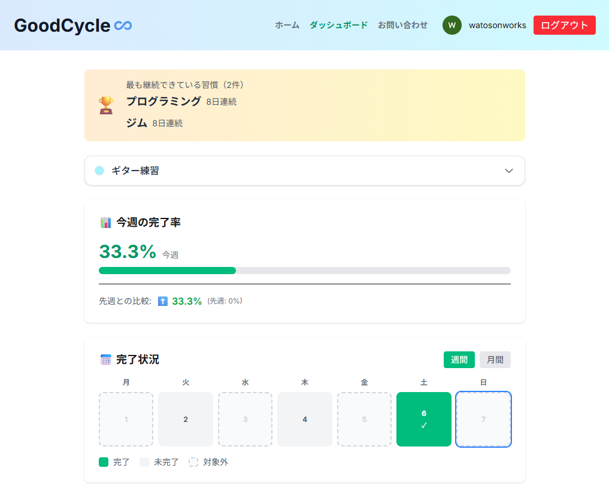

## GoodCycle ♾️（習慣化トラッカーアプリ）

Next.js (App Router) と Firebase を使って作成した、**習慣の継続を「見える化」するトラッキングアプリ**です。  
毎日の完了状況をカード・カレンダー・グラフで可視化し、「続けやすい仕組み」を提供します。

---

## デモ

- **本番URL**: ※ここに Vercel の URL を記載してください（例：`https://goodcycle-habit-app.vercel.app`）

---

## 主な機能

- **ユーザー認証**
  - Firebase Authentication によるメールアドレス＆パスワード認証
  - ログイン状態に応じたナビゲーション制御

- **習慣の登録・編集・削除**
  - 習慣追加モーダルから、タイトル・カテゴリ・カラーなどを設定
  - 完了状態の ON/OFF、不要になった習慣の削除

- **ダッシュボード**
  - 当日の習慣一覧と完了状況
  - 月間カレンダーによる完了状況の可視化
  - 月ごとの達成率・トレンドグラフ（Recharts）

- **フィルタリング・カテゴリ管理**
  - カテゴリごとの絞り込み
  - 習慣カラー・カテゴリの管理

- **お問い合わせフォーム**
  - EmailJS を使った問い合わせ送信フォーム
  - バリデーション・送信中状態・成功/エラー表示
  - Gmail / GitHub アカウントへのリンク

---

## 技術スタック

- **フロントエンド**
  - Next.js 16（App Router / TypeScript）
  - React 19
  - Tailwind CSS 4

- **バックエンド / BaaS**
  - Firebase Authentication
  - Cloud Firestore

- **状態管理・ロジック**
  - Zustand（クライアント状態管理）
  - カスタムフック（クリック外検知など）

- **可視化 / UI**
  - Recharts（グラフ表示）
  - 自作コンポーネント（ダッシュボードカード、タブ、モーダルなど）

---

## 画面イメージ（例）

※ スクリーンショットを撮影して、`/public` 配下に保存し、ここに貼る想定です。

- トップページ（アプリ概要・ログイン導線）
- ダッシュボード（習慣一覧＋達成状況）
- 月間カレンダー / グラフ表示
- お問い合わせページ

```md


```

---

## 開発環境での動かし方

```bash
git clone https://github.com/watowaworks/goodcycle-habit-app.git
cd goodcycle-habit-app
npm install
npm run dev
```

ブラウザで `http://localhost:3000` にアクセスします。

---

## 環境変数

プロジェクト直下に `.env.local` を作成し、Firebase / EmailJS の設定を追加します。

```env
NEXT_PUBLIC_FIREBASE_API_KEY=...
NEXT_PUBLIC_FIREBASE_AUTH_DOMAIN=...
NEXT_PUBLIC_FIREBASE_PROJECT_ID=...
NEXT_PUBLIC_FIREBASE_STORAGE_BUCKET=...
NEXT_PUBLIC_FIREBASE_MESSAGING_SENDER_ID=...
NEXT_PUBLIC_FIREBASE_APP_ID=...

NEXT_PUBLIC_EMAILJS_SERVICE_ID=...
NEXT_PUBLIC_EMAILJS_TEMPLATE_ID=...
NEXT_PUBLIC_EMAILJS_PUBLIC_KEY=...
```

---

## デプロイ

- **ホスティング**: Vercel
- GitHub への push をトリガーに、自動でビルド & デプロイされます。
- 本番環境では、Firebase Authentication の「承認済みドメイン」に  
  `*.vercel.app`（実際の URL）を追加する必要があります。

---

## 作者

- **GitHub**: https://github.com/watowaworks
- **Contact**: Gmail (`watosonworks@gmail.com`)
